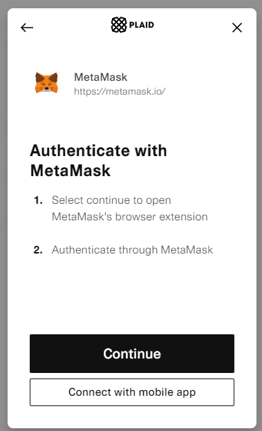

# ❓ About us: Web3.Map

<figure><figcaption></figcaption></figure>

Мы - группа энтузиастов, которые хотят создать не просто очередной информационный проект, но создать экосистему, направленную на изучение Web3 пространства и его развитие. Наша цель упростить взаимодействие пользователей и частных инвесторов с проектами, представляющими для них интерес. Очень часто действительно стоящие проекты проходят мимо глаз, оставаясь без поддержки аудитории. Наш первичный продукт будет представлять из себя базу данных с развитой архитектурой для упрощенного поиска нужного проекта.

Другие наши проекты:&#x20;


[Web3.Ban](https://app.gitbook.com/o/gj2fOz2JmGRFlS9ijPqM/s/TiRf6MS61npTFs08P0Pq/)



[Web3.Adv](https://app.gitbook.com/o/gj2fOz2JmGRFlS9ijPqM/s/QJXwGXRdzcRet84xHIVF/)



[Web3.Socials](https://app.gitbook.com/o/gj2fOz2JmGRFlS9ijPqM/s/CCiwM3CCd5SQtTG3jIxw/)


## What is Web3.Map?

Web3.Map is a part of Web3.Corp compant that aims to collect&#x20;
