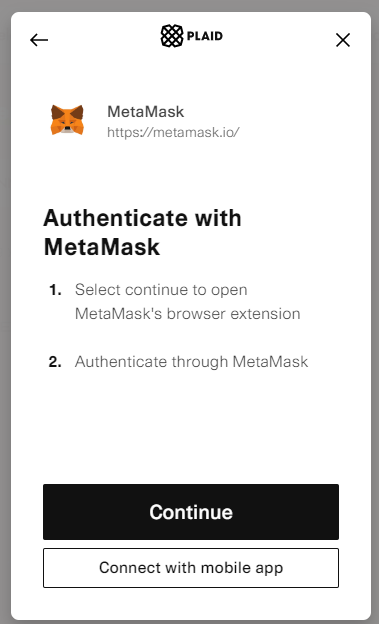

# Confirming wallet

## About

You can confirm your wallet in discord for:

1. EWOO.NFT
2. EWOO.DAO
3. EWOO airdrop for first 1000 members

## Confirming wallet for EWOO.NFT

For this confirmation you should have <mark style="color:yellow;">Whitelisted</mark> or <mark style="color:yellow;">OG</mark> role in discord. OG will given for first 1000 members in discord. Whitelisted role will be given only in discord activities

1. Verify yourself on discord server:\
    (1).png>)\
   .png>)
2. Go to #wallet-confirmation channel\
    (1).png>)
3. Confirm your wallet on this panel\
   .png>)
4. Gotcha!

Now u should have confirmed wallet and this role:\
 (1).png>)

## Confirming wallet for EWOO.DAO

More about this bot u can read [here](https://docs.5.dev/2.5-nft-management-bots/2.5-role-bot)

For this confirmation and access to EWOO.DAO you should confirm your wallet here:

1. /register\
   .png>)
2. Click to "register"\
   .png>)
3. Yep\
   .png>)
4. Connect your wallet\
   .png>)
5. Authenticate\
   
6. Connect\
   .png>)
7. Done!\
   .png>)
8. Now u can check your wallet status :)\
   .png>)
9. Dont forget press SHARE button to get your roles\
   .png>)\
   .png>)\

Members with  @💎(1 diamond) or more OR 🐬 Dolphin can join to our EWOO.DAO

.png>)

## Confirming wallet for "1000 members" airdrop

soon :eyes:

##
